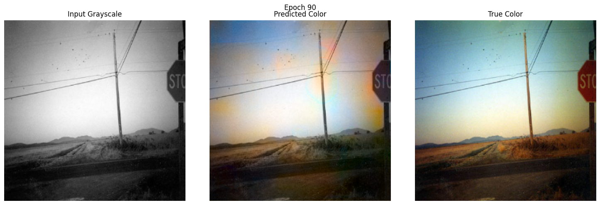

 # Image Colorizer with CNN (TensorFlow)

This project implements an automatic image colorization tool using a custom Convolutional Neural Network (CNN) in TensorFlow. It converts grayscale images into realistic color images by learning from example photos.

---

## Features

- Custom encoder-decoder CNN for image colorization
- TensorFlow 2.x compatible (runs in TF 1.x graph mode using `tf.compat.v1`)
- Handles data loading, training, and evaluation in one script
- Saves example output images to the `colorization_outputs/` directory

---

## Example Result

The following example shows the input grayscale image, the predicted colorization, and the ground truth color side-by-side:



> Replace `examples/example_result.png` with your own result image for the best showcase!

---

## Installation

1. **Clone the repository:**
   ```bash
   git clone https://github.com/Grimk0/image-colorizer.git
   cd image-colorizer
   ```

2. **Install dependencies:**  
   *(Recommend using a virtual environment)*
   ```bash
   pip install -r requirements.txt
   ```

---

## Usage

1. **Prepare your dataset:**  
   Update the `train_dir` and `test_dir` variables in `Colorization_CNN_Tensorflow_AyubMohamed.py` to point to your image folders.

2. **Run the script:**  
   ```bash
   python Colorization_CNN_Tensorflow_AyubMohamed.py
   ```

3. **View results:**  
   Colorized results will be saved in the `colorization_outputs/` directory.

---

## How it Works

- The model operates in LAB color space, predicting the AB channels from the grayscale L channel.
- Uses a deep encoder-decoder CNN architecture.
- Custom loss function encourages realistic colorization and penalizes extreme values.
- Automatically saves side-by-side visual results for easy comparison.

---

## Contributing

Contributions are welcome!  
Feel free to open issues or submit pull requests for improvements.

---

## License

This project is licensed under the MIT License.  
See [LICENSE](LICENSE) for details.

---

## Acknowledgements

- Based on open datasets and research in deep learning image colorization.
- Inspired by classic colorization papers and community tutorials.